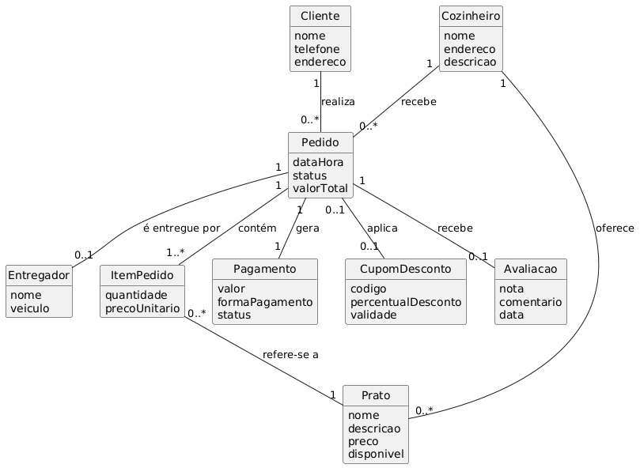

# SaborBrasileiro — Marketplace de Delivery de Comida Caseira

Repositório da Entrega 1 do projeto **SaborBrasileiro**, disciplina de Desenvolvimento de Sistemas 2.

Esta entrega cobre as seguintes etapas do processo:

1. **Cenário de Negócio e Concepção do Sistema** (com a Declaração de Escopo)
2. **Modelo de Caso de Uso** (atores e diagrama UML em PlantUML)
3. **Modelagem de Negócio** (stakeholders, regras de negócio, modelo de domínio conceitual e fluxo de atividades)
4. **Prototipação** (wireframes de média fidelidade das 10 telas principais)
5. **Especificação de Requisitos** (RF e RNF classificados no modelo FURPS+, com rastreabilidade)

## Sobre o projeto

O **SaborBrasileiro** é uma plataforma de marketplace que conecta **cozinheiros caseiros** (pequenos produtores de comida feita em casa) a **clientes** de um bairro ou região, com entrega feita por **entregadores parceiros** cadastrados na plataforma — similar a um iFood, mas focado exclusivamente em comida caseira/artesanal, sem restaurantes formais.

## Estrutura do repositório

```
entrega1-cenario-caso-uso/
├── README.md
├── docs/
│   ├── 01-cenario-negocio-escopo.md   # Cenário de negócio + Declaração de Escopo
│   ├── 02-modelo-caso-uso.md          # Modelo de Caso de Uso
│   ├── 03-modelagem-negocio.md        # Stakeholders, regras de negócio, modelo de domínio
│   ├── 04-prototipacao.md             # Wireframes das 10 telas principais
│   └── 05-especificacao-requisitos.md # RF e RNF em FURPS+ com rastreabilidade
├── diagramas/
│   ├── diagrama-caso-uso.puml/.png    # Diagrama de casos de uso
│   ├── modelo-dominio.puml/.png       # Diagrama de classes conceitual (modelo de domínio)
│   └── fluxo-pedido.puml/.png         # Diagrama de atividades do fluxo de pedido
└── prototipos/
    └── *.svg                          # Wireframes das 10 telas principais
```

## Diagrama de Caso de Uso


## Modelo de Domínio



## Como visualizar o diagrama PlantUML

O arquivo `diagramas/diagrama-caso-uso.puml` pode ser visualizado de três formas:

- **VS Code**: instale a extensão "PlantUML" (jebbs.plantuml) e use `Alt+D` com o arquivo aberto.
- **Online**: cole o conteúdo do arquivo em https://www.plantuml.com/plantuml/uml/
- **GitHub**: adicionando o arquivo `.puml`, ele é reconhecido como código-fonte; para ver a imagem renderizada direto no README, pode-se usar o serviço [PlantUML Server](https://www.plantuml.com/plantuml) gerando um link de imagem a partir do conteúdo do arquivo.

## SAMUEL PATTO MARCONDES MANFREDINI FERREIRA - 32155549
