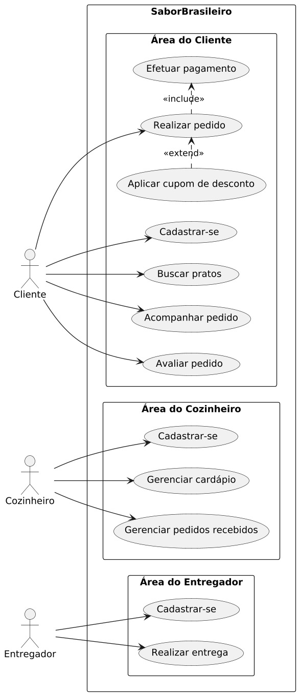
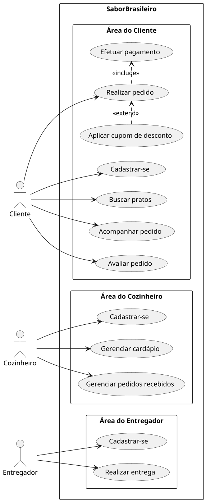

# Modelo de Caso de Uso — SaborBrasileiro

## 1. Requisitos funcionais (visão geral)

Os requisitos completos (funcionais e não funcionais, classificados no modelo **FURPS+**, com critérios de aceite e rastreabilidade) estão detalhados no documento dedicado: [**05 — Especificação de Requisitos**](05-especificacao-requisitos.md). Abaixo, um resumo dos requisitos funcionais que dão origem diretamente aos casos de uso deste documento:

| Código | Requisito funcional | Ator principal |
|---|---|---|
| RF01 | Cadastrar-se na plataforma | Cliente / Cozinheiro / Entregador |
| RF02 | Gerenciar cardápio (cadastrar, editar, remover pratos, marcar disponibilidade) | Cozinheiro |
| RF03 | Buscar pratos e cozinheiros por região | Cliente |
| RF04 | Realizar pedido | Cliente |
| RF05 | Efetuar pagamento do pedido | Cliente |
| RF06 | Aplicar cupom de desconto | Cliente |
| RF07 | Gerenciar pedidos recebidos (aceitar/recusar, atualizar status de preparo) | Cozinheiro |
| RF08 | Aceitar e realizar entrega | Entregador |
| RF09 | Acompanhar status do pedido em tempo real | Cliente |
| RF10 | Avaliar pedido e entrega | Cliente |

---

## 2. Atores

| Ator | Descrição |
|---|---|
| **Cliente** | Usuário que busca, pede e paga por comida caseira |
| **Cozinheiro** | Usuário que cadastra cardápio e prepara os pedidos |
| **Entregador** | Usuário que aceita e realiza a entrega dos pedidos |

## 3. Casos de uso

| Código | Caso de uso | Ator(es) | Descrição resumida |
|---|---|---|---|
| UC01 | Cadastrar-se | Cliente, Cozinheiro, Entregador | Criar conta na plataforma informando dados básicos |
| UC02 | Gerenciar cardápio | Cozinheiro | Cadastrar, editar ou remover pratos oferecidos |
| UC03 | Buscar pratos | Cliente | Pesquisar pratos/cozinheiros disponíveis na região |
| UC04 | Realizar pedido | Cliente | Selecionar pratos e confirmar um pedido |
| UC05 | Efetuar pagamento | Cliente | Pagar pelo pedido dentro da plataforma |
| UC06 | Gerenciar pedidos recebidos | Cozinheiro | Aceitar/recusar pedido e atualizar status de preparo |
| UC07 | Realizar entrega | Entregador | Aceitar uma entrega disponível e atualizar seu status até a conclusão |
| UC08 | Avaliar pedido | Cliente | Avaliar o prato e a entrega após concluído |
| UC09 | Acompanhar pedido | Cliente | Visualizar em tempo real o status do pedido (recebido, em preparo, a caminho, entregue) |

### 3.1 Relacionamentos entre casos de uso

- **UC04 (Realizar pedido)** `<<include>>` **UC05 (Efetuar pagamento)** — todo pedido exige pagamento para ser confirmado;
- **UC04 (Realizar pedido)** pode ser estendido por **Aplicar cupom de desconto** (`<<extend>>`), quando o cliente possuir um cupom válido.

## 4. Diagrama de caso de uso (PlantUML)

O código-fonte do diagrama está em [`diagramas/diagrama-caso-uso.puml`](../diagramas/diagrama-caso-uso.puml). A imagem já renderizada está em [`diagramas/diagrama-caso-uso.png`](../diagramas/diagrama-caso-uso.png):

Código-fonte:

## 5. Observações finais

Este modelo oferece a base funcional do SaborBrasileiro e servirá de ponto de partida para a etapa seguinte do projeto: a especificação detalhada de cada caso de uso (fluxo principal, fluxos alternativos e de exceção), que dará suporte ao projeto de software e à implementação.
