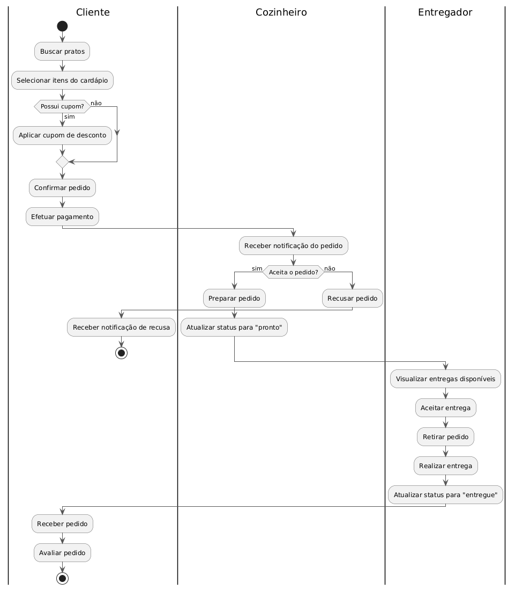

# Modelagem de Negócio — SaborBrasileiro

Este documento descreve, de forma estruturada, como o sistema SaborBrasileiro funciona do ponto de vista de negócio — conectando o contexto já apresentado no [Cenário de Negócio](01-cenario-negocio-escopo.md) com os [Casos de Uso](02-modelo-caso-uso.md) e as [telas do protótipo](04-prototipacao.md).

## 1. Contexto do sistema

O SaborBrasileiro resolve o problema da falta de visibilidade e organização do comércio informal de comida caseira: conecta **cozinheiros caseiros** a **clientes** de uma mesma região, com entrega feita por **entregadores parceiros**, tudo dentro de um único fluxo digital de busca, pedido, pagamento e entrega (ver seção 1 e 2 do cenário de negócio).

## 2. Stakeholders

| Stakeholder | Interesse no sistema |
|---|---|
| Cliente | Encontrar comida caseira de qualidade perto de casa, com pedido e pagamento simples |
| Cozinheiro | Ganhar visibilidade e organizar seus pedidos sem depender de WhatsApp |
| Entregador | Ter uma fonte organizada de corridas de entrega |
| Administrador da plataforma | Garantir qualidade, mediar conflitos e manter o sistema funcionando |
| Mantenedores do projeto (equipe) | Entregar um sistema que resolva o problema real dentro do prazo acadêmico |

## 3. Regras de negócio

| Código | Regra |
|---|---|
| RN01 | Um pedido só pode ser confirmado após o pagamento ser efetuado com sucesso |
| RN02 | Um cupom de desconto só pode ser aplicado a um pedido por vez, e apenas se estiver dentro da validade |
| RN03 | Um cozinheiro só pode visualizar e gerenciar pedidos destinados a ele mesmo |
| RN04 | Um pedido só passa para "em preparo" depois que o cozinheiro aceita explicitamente |
| RN05 | Um entregador só pode estar vinculado a uma entrega em andamento por vez |
| RN06 | Um pedido só pode ser avaliado pelo cliente depois que o status estiver como "entregue" |
| RN07 | Um prato só aparece disponível para pedido se o cozinheiro o marcar como "disponível" |
| RN08 | O valor total do pedido é a soma dos itens, descontado o cupom (quando aplicável) |

## 4. Modelo de domínio (diagrama de classes conceitual)

O modelo abaixo representa as principais entidades do negócio e como elas se relacionam — independente de como serão implementadas depois (é um modelo **conceitual**, não um modelo de dados de banco).

Fonte: [`diagramas/modelo-dominio.puml`](../diagramas/modelo-dominio.puml)

### Principais relações
- Um **Cliente** realiza vários **Pedidos**; um **Cozinheiro** recebe vários **Pedidos** e oferece vários **Pratos**;
- Cada **Pedido** contém um ou mais **ItemPedido**, e cada item se refere a um **Prato** específico;
- Cada **Pedido** gera um **Pagamento**, pode aplicar um **CupomDesconto**, pode ser entregue por um **Entregador** e pode receber uma **Avaliação** do cliente.

## 5. Como os atores usam o sistema (casos de uso + fluxo)

A relação entre atores e funcionalidades já foi detalhada na tabela de casos de uso (UC01 a UC08, ver [documento de caso de uso](02-modelo-caso-uso.md)). Abaixo, o fluxo de atividades do processo mais importante do negócio — **realizar um pedido, do pedido à entrega** — amarrando as ações de Cliente, Cozinheiro e Entregador:

Fonte: [`diagramas/fluxo-pedido.puml`](../diagramas/fluxo-pedido.puml)

Esse fluxo mostra como os casos de uso **UC04 (Realizar pedido)**, **UC05 (Efetuar pagamento)**, **UC06 (Gerenciar pedidos recebidos)**, **UC07 (Realizar entrega)** e **UC08 (Avaliar pedido)** se conectam na prática, em sequência, através dos três atores do sistema.

## 6. Rastreabilidade: negócio ↔ casos de uso ↔ protótipo

Para garantir que tudo esteja conectado (conforme pedido na entrega), a tabela abaixo liga cada caso de uso principal à tela do protótipo que o representa e às entidades do modelo de domínio envolvidas:

| Caso de uso | Tela do protótipo | Entidades envolvidas |
|---|---|---|
| UC01 – Cadastrar-se / Login | [01-login](../prototipos/01-login.svg), [02-cadastro](../prototipos/02-cadastro.svg) | Cliente, Cozinheiro, Entregador |
| UC03 – Buscar pratos | [03-home-busca-cliente](../prototipos/03-home-busca-cliente.svg) | Cozinheiro, Prato |
| UC04 – Realizar pedido | [04-cardapio-pedido-cliente](../prototipos/04-cardapio-pedido-cliente.svg) | Prato, ItemPedido, Pedido |
| UC05 – Efetuar pagamento / aplicar cupom | [05-confirmar-pagamento-cliente](../prototipos/05-confirmar-pagamento-cliente.svg) | Pedido, Pagamento, CupomDesconto |
| UC09 – Acompanhar pedido | [06-acompanhamento-pedido-cliente](../prototipos/06-acompanhamento-pedido-cliente.svg) | Pedido, Entregador |
| UC08 – Avaliar pedido | [07-avaliar-pedido-cliente](../prototipos/07-avaliar-pedido-cliente.svg) | Pedido, Avaliacao |
| UC06 – Gerenciar pedidos recebidos | [08-painel-cozinheiro-pedidos](../prototipos/08-painel-cozinheiro-pedidos.svg) | Pedido, Cozinheiro |
| UC02 – Gerenciar cardápio | [09-gerenciar-cardapio-cozinheiro](../prototipos/09-gerenciar-cardapio-cozinheiro.svg) | Prato, Cozinheiro |
| UC07 – Realizar entrega | [10-painel-entregador-entregas](../prototipos/10-painel-entregador-entregas.svg) | Pedido, Entregador |
