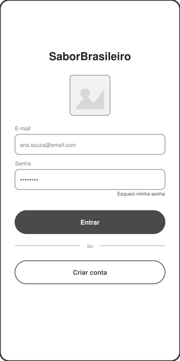
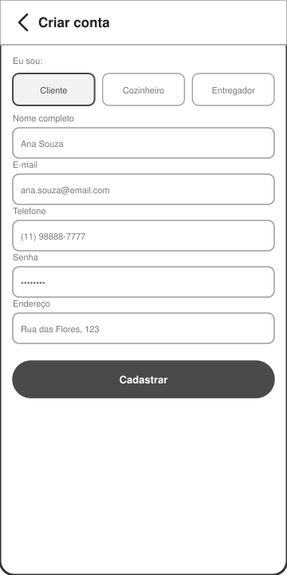
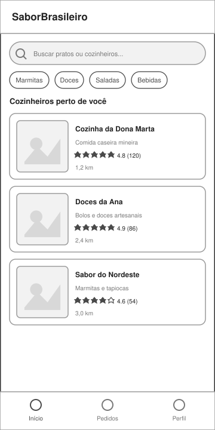
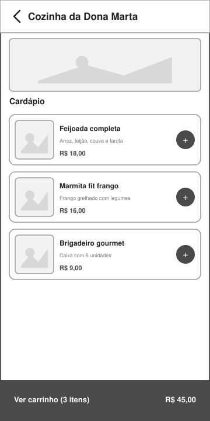
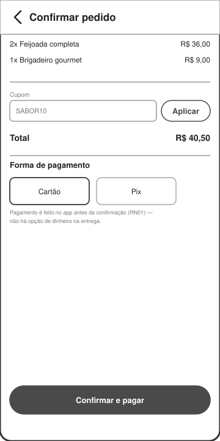
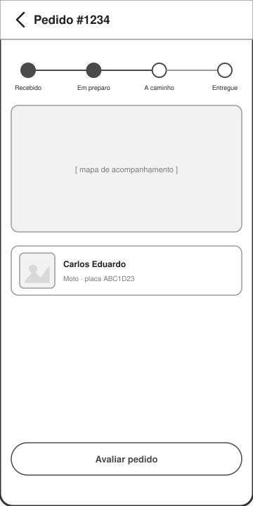
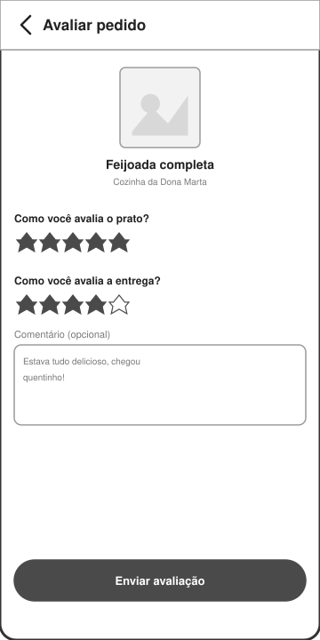
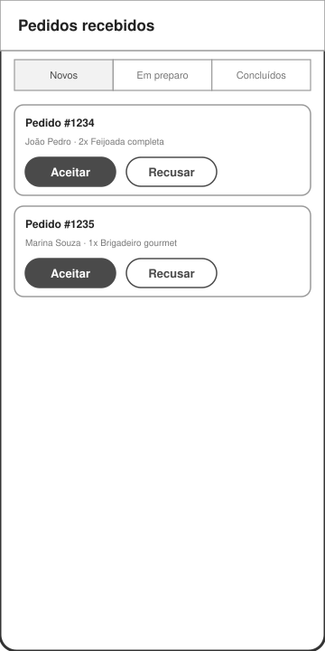
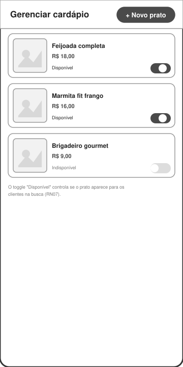
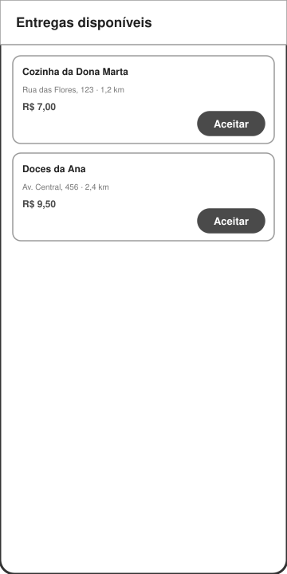

# Prototipação — SaborBrasileiro

Wireframes de média fidelidade das **10 telas** principais do sistema, cobrindo os três atores (Cliente, Cozinheiro e Entregador). O foco aqui é a **estrutura da tela**, a **organização dos elementos** e o **fluxo de navegação** — não o visual final (cores, fontes, identidade visual ficam para uma etapa posterior de design).

Os arquivos-fonte (`.svg`, editáveis em qualquer navegador ou ferramenta vetorial) estão em [`../prototipos/`](../prototipos/).

## Fluxo de navegação geral

```
[Login/Cadastro] ──▶ (conforme o perfil escolhido)

[Cliente]
Home/Busca ──▶ Cardápio do Cozinheiro ──▶ Confirmar Pedido/Pagamento ──▶ Acompanhamento do Pedido ──▶ Avaliar Pedido

[Cozinheiro]
Pedidos Recebidos (aceitar/recusar) ──▶ (atualiza status, refletido no acompanhamento do Cliente)
Gerenciar Cardápio (criar/editar pratos, marcar disponibilidade)

[Entregador]
Entregas Disponíveis (aceitar) ──▶ (atualiza status, refletido no acompanhamento do Cliente)
```

## 1. Login — UC01



**Estrutura:** logo/nome do app centralizado no topo, campos de e-mail e senha, ação principal em destaque e alternativa de criar conta abaixo.
**Organização:** um único caminho de entrada serve para os três tipos de usuário — a diferenciação de perfil só acontece no cadastro.
**Fluxo:** login bem-sucedido leva à tela inicial do perfil correspondente (Cliente → Home/Busca; Cozinheiro → Pedidos Recebidos; Entregador → Entregas Disponíveis). "Criar conta" leva à tela de cadastro (tela 2).

## 2. Cadastro — UC01



**Estrutura:** seletor de perfil no topo (Cliente / Cozinheiro / Entregador) seguido de um formulário único.
**Organização:** um único formulário serve para os três perfis — na versão final, campos específicos (ex: descrição do cozinheiro, tipo de veículo do entregador) podem aparecer condicionalmente conforme o perfil selecionado.
**Fluxo:** ao cadastrar, o usuário é autenticado automaticamente e levado à tela inicial do seu perfil.

## 3. Home / Busca (Cliente) — UC03



**Estrutura:** barra de busca no topo, filtros por categoria (chips horizontais) e lista de cozinheiros em cards.
**Organização:** cada card traz foto, nome, descrição, avaliação e distância — as informações que mais pesam na decisão do cliente aparecem primeiro.
**Fluxo:** tocar em um card leva para a tela de cardápio daquele cozinheiro (tela 4).

## 4. Cardápio do Cozinheiro / Montar Pedido (Cliente) — UC04



**Estrutura:** banner do cozinheiro no topo, lista de pratos abaixo (com nome, descrição e preço), barra fixa de carrinho na base.
**Organização:** botão "+" em cada prato para adicionar ao carrinho sem sair da tela; barra inferior sempre visível mostra total parcial, reduzindo fricção.
**Fluxo:** tocar na barra de carrinho leva para a tela de confirmação de pedido (tela 5).

## 5. Confirmar Pedido / Pagamento (Cliente) — UC05



**Estrutura:** resumo dos itens no topo, campo de cupom, total, seleção de forma de pagamento e botão de ação fixo na base.
**Organização:** o cupom fica antes do total para deixar claro que ele impacta o valor final; formas de pagamento em blocos grandes, fáceis de tocar. Só há opções de pagamento **dentro do app** (Cartão, Pix) — não há opção de dinheiro na entrega, para manter consistência com a **RN01** (o pedido só é confirmado depois do pagamento ser efetuado com sucesso).
**Fluxo:** ao confirmar, o pedido é enviado ao cozinheiro e o cliente é direcionado à tela de acompanhamento (tela 6).

## 6. Acompanhamento do Pedido (Cliente) — UC09



**Estrutura:** stepper horizontal com as 4 etapas do pedido no topo, área de mapa/rastreio no meio, dados do entregador abaixo.
**Organização:** o stepper deixa claro em qual etapa o pedido está sem precisar de texto explicativo.
**Fluxo:** o botão "Avaliar pedido" só fica habilitado quando o status chega a "Entregue" (RN06), levando à tela de avaliação (tela 7).

## 7. Avaliar Pedido (Cliente) — UC08



**Estrutura:** identificação do prato/cozinheiro avaliado, duas escalas de estrelas (prato e entrega, separadas porque são feitas por atores diferentes) e campo de comentário opcional.
**Organização:** separar a nota do prato da nota da entrega evita que uma entrega ruim penalize injustamente a avaliação do cozinheiro (e vice-versa).
**Fluxo:** ao enviar, a avaliação fica associada ao pedido e some o botão de avaliar nas telas seguintes daquele pedido.

## 8. Painel do Cozinheiro — Pedidos Recebidos — UC06



**Estrutura:** abas para separar pedidos por status (Novos / Em preparo / Concluídos), lista de cards de pedido abaixo.
**Organização:** ações de "Aceitar"/"Recusar" ficam visíveis direto no card, sem exigir que o cozinheiro entre em outra tela para decidir.
**Fluxo:** ao aceitar, o pedido some da aba "Novos" e aparece em "Em preparo" (RN04); o status é refletido automaticamente no acompanhamento do cliente (tela 6).

## 9. Gerenciar Cardápio (Cozinheiro) — UC02



**Estrutura:** botão de adicionar prato no topo, lista de pratos já cadastrados com foto, nome, preço e um controle de disponibilidade (toggle) por item.
**Organização:** o toggle "Disponível/Indisponível" fica em destaque em cada prato — é ele que decide se o prato aparece para os clientes na busca (**RN07**), sem precisar abrir outra tela.
**Fluxo:** tocar em "+ Novo prato" abre o formulário de cadastro de prato (nome, descrição, preço, foto); tocar em um prato existente permite editá-lo.

## 10. Painel do Entregador — Entregas Disponíveis — UC07



**Estrutura:** lista simples de corridas disponíveis, com origem, destino/distância, valor da corrida e botão de aceitar.
**Organização:** as informações mais relevantes para a decisão do entregador (distância, valor) ficam visíveis sem precisar abrir a corrida.
**Fluxo:** ao aceitar, a corrida se vincula ao entregador (RN05) e o status do pedido avança para "a caminho", visível na tela de acompanhamento do cliente (tela 6).

---

Ver também: [Modelagem de Negócio](03-modelagem-negocio.md) (para as regras de negócio referenciadas acima) e [Modelo de Caso de Uso](02-modelo-caso-uso.md).
